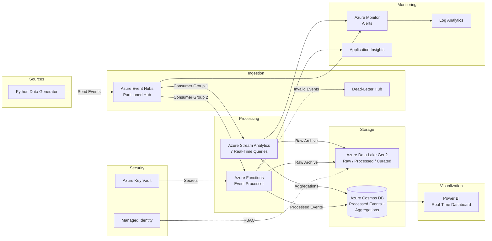

# Netflix Real-Time Streaming Data Pipeline

A production-grade, real-time data pipeline on Azure that ingests, processes, and visualises Netflix-style streaming events at scale (100–1,000+ events/sec).

---

## Architecture



---

## Project Structure

```
netflix-streaming-pipeline/
├── README.md                        # This file
├── requirements.txt                 # Python dependencies
├── .env.example                     # Environment variables template
├── config.yaml                      # Pipeline configuration
├── .gitignore
├── deploy.sh                        # Bash deployment script
├── deploy.ps1                       # PowerShell deployment script
│
├── data_generator/                  # Event simulator
│   ├── __init__.py
│   ├── models.py                    # StreamingEvent data model
│   ├── generator.py                 # Async event generator + Event Hub publisher
│   └── sample_data.json             # 5 sample events for testing
│
├── infrastructure/
│   ├── terraform/                   # Terraform IaC
│   │   ├── main.tf                  # All Azure resources
│   │   ├── variables.tf             # Input variables
│   │   ├── outputs.tf               # Output values
│   │   └── terraform.tfvars.example
│   └── bicep/                       # Azure Bicep IaC
│       ├── main.bicep               # Orchestration template
│       ├── parameters.json
│       ├── queries/
│       │   └── combined_query.asaql
│       └── modules/
│           ├── eventhubs.bicep
│           ├── cosmosdb.bicep
│           ├── datalake.bicep
│           ├── streamanalytics.bicep
│           ├── monitoring.bicep
│           ├── identity.bicep
│           └── keyvault.bicep
│
├── stream_analytics/
│   ├── transformation.json          # Input/output config reference
│   └── queries/
│       ├── realtime_viewer_count.asaql
│       ├── avg_watch_time.asaql
│       ├── trending_content.asaql
│       ├── geo_distribution.asaql
│       ├── device_distribution.asaql
│       ├── buffer_detection.asaql
│       └── engagement_scoring.asaql
│
├── functions/                       # Azure Functions (Python v2)
│   ├── host.json
│   ├── local.settings.json
│   ├── requirements.txt
│   ├── process_events/              # Write to Cosmos DB
│   │   ├── __init__.py
│   │   └── function.json
│   └── archive_raw/                 # Archive to ADLS Gen2
│       ├── __init__.py
│       └── function.json
│
├── powerbi/
│   ├── dataset_config.json          # Streaming dataset schema
│   ├── dax_measures.md              # KPI measures & dashboard layout
│   └── dashboard_layout.json        # Visual layout specification
│
├── monitoring/
│   ├── alerts.json                  # Azure Monitor alert rules
│   └── log_analytics_queries.json   # Saved KQL queries
│
└── tests/
    ├── conftest.py                  # Shared fixtures
    ├── test_generator.py            # Data generator tests
    └── test_processor.py            # Event processor tests
```

---

## Prerequisites

| Tool | Version | Purpose |
|------|---------|---------|
| Python | 3.9+ | Data generator, Azure Functions |
| Azure CLI | 2.50+ | Resource management |
| Terraform | 1.5+ | Infrastructure deployment (option A) |
| Azure Bicep | 0.22+ | Infrastructure deployment (option B) |
| Azure Functions Core Tools | 4.x | Function deployment |
| Node.js | 18+ | Functions Core Tools dependency |

---

## Quick Start

### 1. Clone and configure

```bash
git clone <repo-url>
cd netflix-streaming-pipeline
cp .env.example .env
# Edit .env with your Azure connection strings
```

### 2. Deploy infrastructure

**Option A – Terraform:**
```bash
cd infrastructure/terraform
cp terraform.tfvars.example terraform.tfvars
# Edit terraform.tfvars
terraform init
terraform plan -out=tfplan
terraform apply tfplan
```

**Option B – Bicep:**
```bash
az login
az deployment sub create \
  --location eastus2 \
  --template-file infrastructure/bicep/main.bicep \
  --parameters infrastructure/bicep/parameters.json
```

**Option C – One-command deploy:**
```bash
chmod +x deploy.sh
./deploy.sh terraform dev    # or: ./deploy.sh bicep dev
```

### 3. Run the data generator

```bash
# Install dependencies
python3 -m venv .venv && source .venv/bin/activate
pip install -r requirements.txt

# Dry run (no Azure connection needed)
python -m data_generator.generator --dry-run --eps 200

# Live (requires Event Hub connection string in .env)
python -m data_generator.generator --eps 500 --duration 300
```

### 4. Run tests

```bash
source .venv/bin/activate
pytest tests/ -v
```

---

## Component Details

### Data Generator

The generator simulates realistic Netflix-style streaming behaviour:

- **20 titles** across movies, TV episodes, documentaries, and specials
- **10,000 simulated users** with varied devices, locations, and subscription tiers
- **5 event types**: `video_start`, `video_pause`, `video_stop`, `video_complete`, `buffer_event`
- **15 global locations** with lat/lon coordinates
- **Weighted distributions** for device types, event types, and subscription tiers
- **Configurable throughput**: 100–1,000+ events/second

### Stream Analytics Queries

| Query | Window | Description |
|-------|--------|-------------|
| Viewer Count | 10s Tumbling | Active viewers per content title |
| Watch Time | 5min Sliding | Average, min, max, median watch duration |
| Trending | 5min Hopping (1min hop) | Trending score with completion rate weighting |
| Geo Distribution | 30s Tumbling | Viewer counts by country/city |
| Device Distribution | 1min Tumbling | Usage and quality by device type |
| Buffer Detection | 1min Tumbling | Buffering hotspots (threshold: 3+ events) |
| Engagement Scoring | 10min Sliding | Composite score with segment classification |

### Security

- **Managed Identity** for service-to-service auth (RBAC on ADLS, Key Vault)
- **Key Vault** stores all connection strings and access keys
- **Separate auth rules**: send-only for generator, listen-only for consumers
- **TLS 1.2** minimum on all storage endpoints
- **No public blob access** on Data Lake

---

## Cost Estimation (Dev Environment)

| Resource | SKU/Config | Estimated Monthly Cost (USD) |
|----------|-----------|------------------------------|
| Event Hubs | Standard, 2 TU | ~$22 + ingress |
| Stream Analytics | 3 SU | ~$220 |
| Cosmos DB | 400 RU/s x 2 containers | ~$47 |
| Data Lake Gen2 | Standard LRS, ~50 GB | ~$1 |
| Azure Functions | Consumption plan | ~$0 (free grant) |
| Key Vault | Standard, low ops | ~$0.03 |
| Log Analytics | 5 GB/month | ~$12 |
| Application Insights | 5 GB/month | ~$12 |
| **Total (Dev)** | | **~$315/month** |

> **Production note**: For 1,000 events/sec sustained, budget ~$600–900/month (higher TUs, more SUs, autoscale Cosmos DB).

---

## Monitoring

Pre-configured alerts for:
- Event Hub request throttling
- Stream Analytics runtime errors and watermark delay
- Cosmos DB RU saturation and 429 throttling
- Azure Function execution failures
- Data Lake availability drops

Saved Log Analytics (KQL) queries cover throughput, latency, errors, and dead-letter tracking. See `monitoring/log_analytics_queries.json`.

---

## License

MIT
